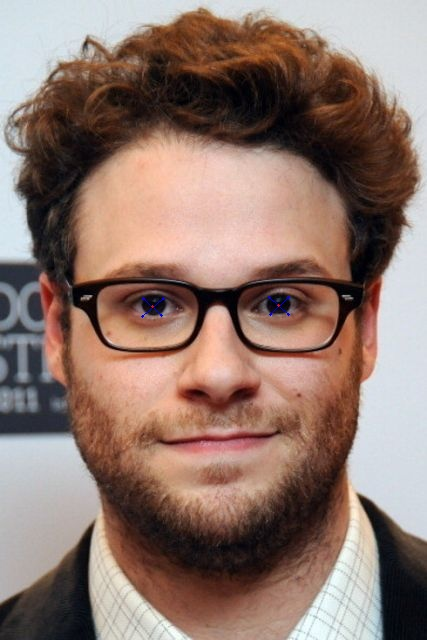

# Facial Landmarks

### Environment
This code is developed using Python 3.6 on Xubuntu 18.04.

### Install dependencies  
```pip install -r requirements.txt```

### Usage
```sh
# in the project root folder
python3 src/facial_landmarks.py --shape-predictor predictor/shape_predictor_68_face_landmarks.dat --image images/image5.jpg
```

### Distance between pupils method (just a simple approximation)
The distance was calculated using euclidean distance




### [Full Tutorial](https://www.pyimagesearch.com/2017/04/03/facial-landmarks-dlib-opencv-python/)